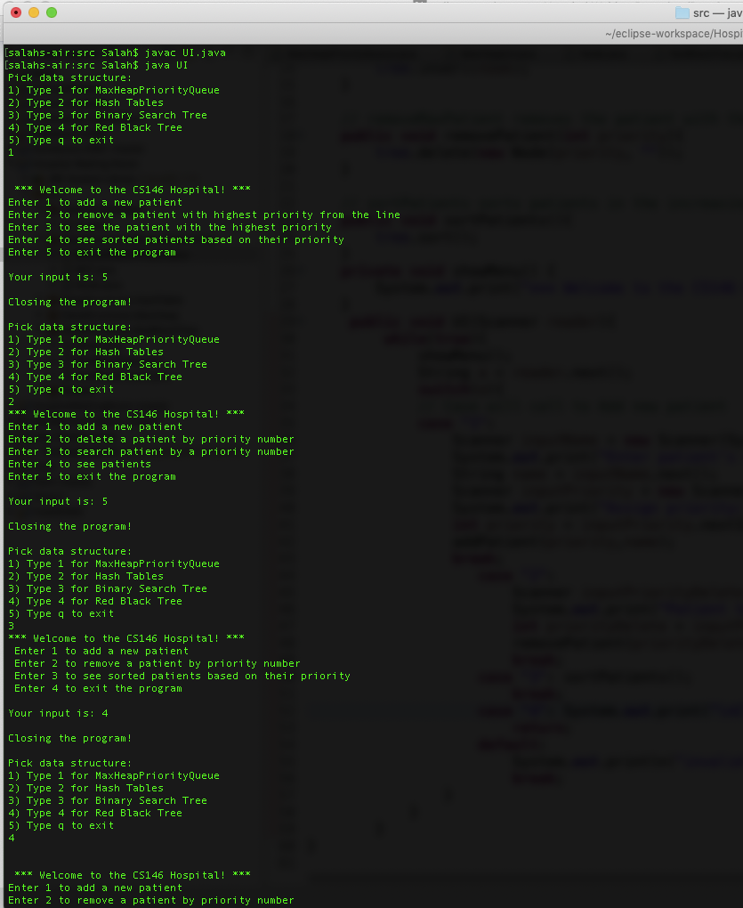

# Hospital-Wating-Room
This program is written to help a hospital emergency room keep track of the patient lists in order for appropriate assistance.
The hospital emergency room prioritizes patients waiting based on the severity of their need. 
The doctors in would see the next most critical patient rather than the one who arrived first.
Larger integers are considered higher priority than smaller ones.

# using 4 approaches ( Data structures):
* MaxHeapPriorityQueue
* Hash Table
* Binary Search Tree
* Red Black Tree

